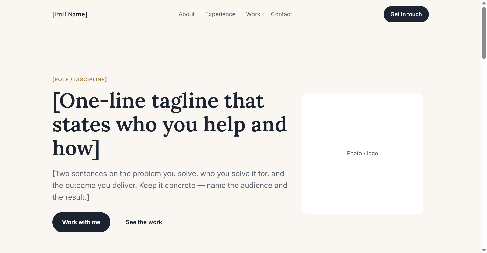
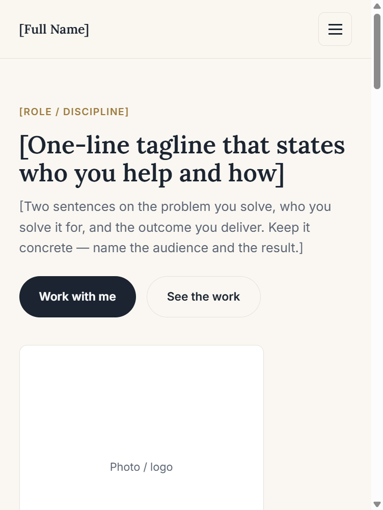
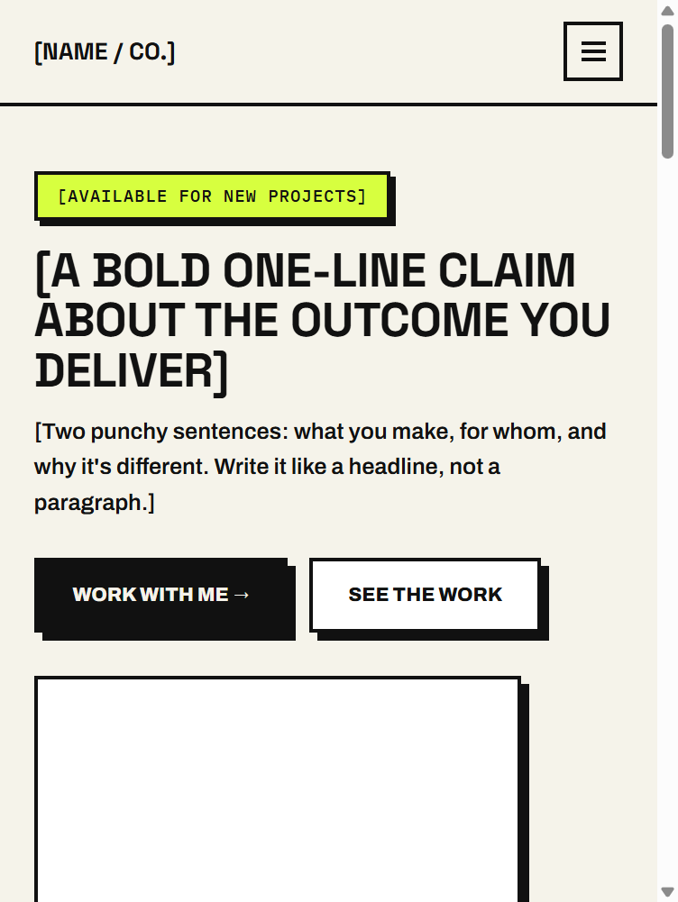
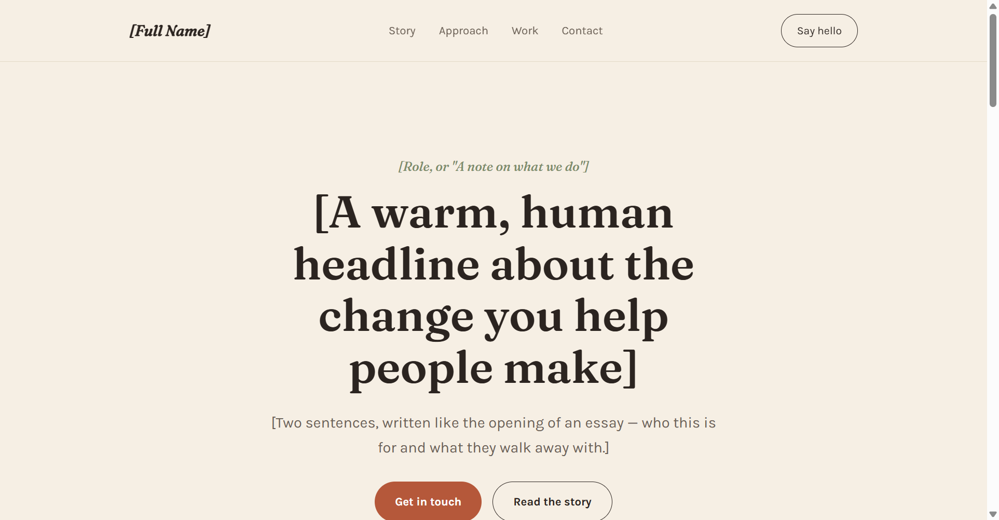
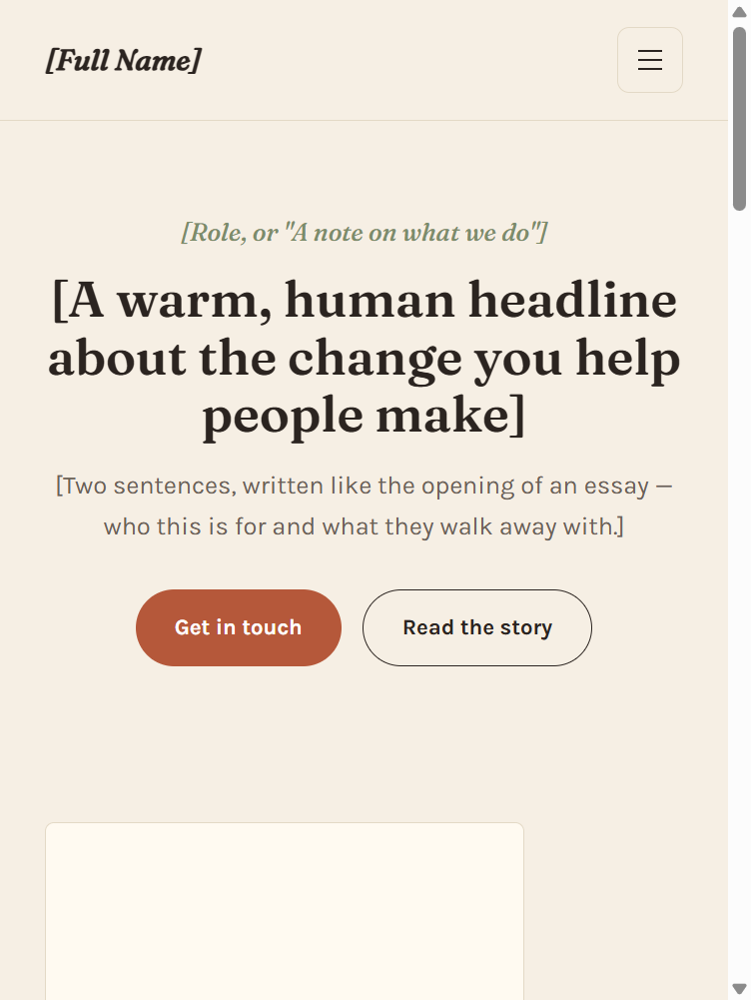
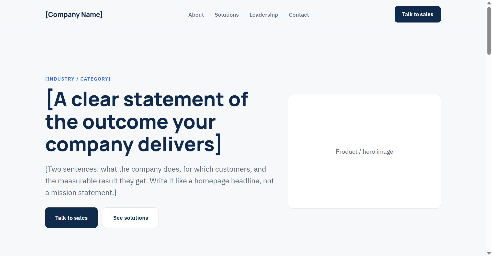
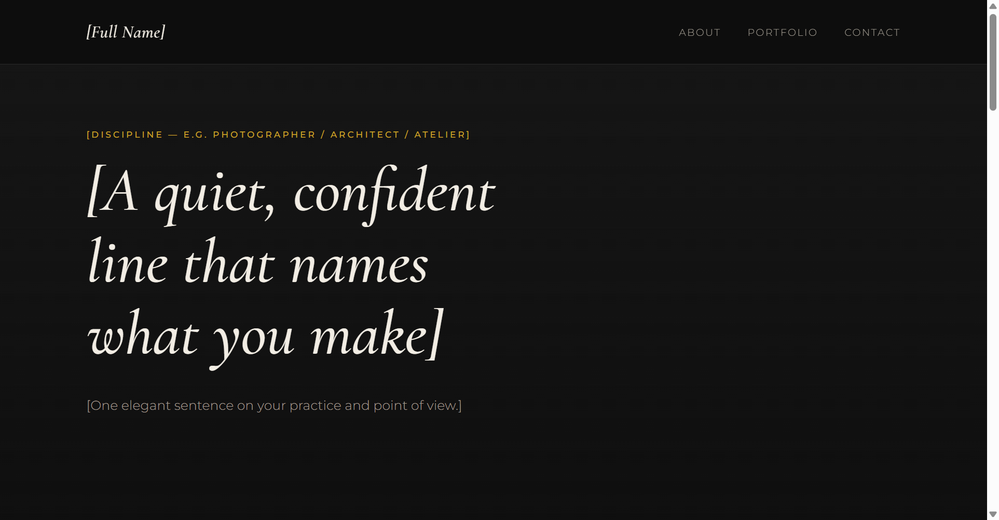
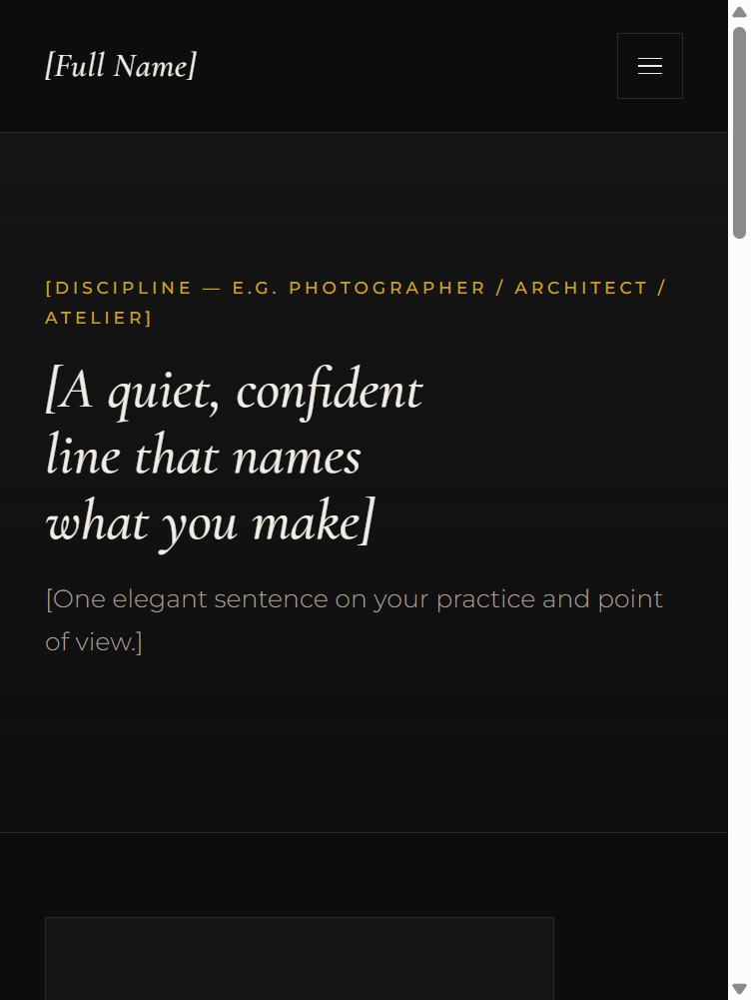

# profile-html-templates

A library of single-page, fully responsive HTML templates, designed so a coding agent can turn a
person's or company's information — bio, résumé, services, business idea, product catalog, menu,
or curriculum — into a finished, good-looking page automatically. Every template is one
self-contained HTML file that adapts from a phone screen to a desktop without a separate mobile
version. Beyond the 8 bio/portfolio templates below, the library also has three site-category
subskills under `categories/`: e-commerce stores, restaurants/cafes, and courses/coaching pages.

**Publishing is the default, not an optional extra.** A finished page isn't just written to
disk — the standard last step is uploading it to object storage and handing back a live public
URL, via `scripts/publish_site.py`. See "Scripts & credentials" below.

Agents using the library should read [`AGENTS.md`](./AGENTS.md). It's the operating manual: how
to read `index.json`, match the user's brief to a template, clone it, and adapt the content.

## Using this as a portable skill

This works as a **skill for any coding agent** — Claude Code, Cursor, Codex CLI, or anything else
that can read files and follow instructions. `AGENTS.md` (and each category's own `AGENTS.md`
under `categories/`) is plain markdown with no dependency on a specific tool ecosystem; a
`SKILL.md` is included only so Claude Code's Skill tool can also discover this folder directly —
every other agent should just be pointed at `AGENTS.md`.

By default the skill reads prepared content instead of only asking questions interactively:

- **`_input/brief.md`** — copy `_input/brief.template.md` to `_input/brief.md` and fill in the
  category you need (profile/bio, e-commerce, restaurant, or course) before running the agent.
  Anything left blank gets asked about interactively instead — nothing is invented.
- **`_input/images/`** and **`_input/videos/`** — drop in any photos, logos, or video you already
  have; reference their filenames from `brief.md` so the agent knows which slot each one fills.
- **`_output/<slug>/`** — the finished page (plus an `assets/` folder for any local media) lands
  here by default, one subfolder per site you build. See `_output/README.md`.

If you'd rather just talk through it, that still works — leave `_input/brief.md` absent (or
incomplete) and the agent falls back to asking everything interactively.

## Scripts & credentials

`scripts/` has self-contained helpers an agent calls while building and shipping a page. This
skill **never generates images** — every photo comes from the user's own `_input/images/`;
`fit_image.py` just crops/resizes what they gave you. Only `write_content.py` and the publishing
scripts talk to a network API; `fit_image.py` needs neither credentials nor `config.json` values
beyond its own defaults.

**Prerequisites:** Python 3.10+, and `pip install -r requirements.txt` (`requests` for
`write_content.py`'s Ark calls and `tos_client.py`'s hand-signed TOS calls, `Pillow` for
`fit_image.py`'s crop/resize — no vendor SDK for TOS; see `tos_client.py`). The HTML templates
themselves have no build step and no dependency on any of this — only the scripts do.

| Script | Does |
|---|---|
| `precheck.py` | **Run this first**, once per session (or after touching credentials/config). Confirms every credential loads and does a live publish→fetch→unpublish round-trip against TOS, so a broken setup surfaces before you've built anything |
| `fit_image.py` | Crops a user's photo to a slot's aspect ratio and resizes it down for the web — local only, no network call, no credentials |
| `write_content.py` | Drafts tagline/bio/section copy from `_input/brief.md` via a chat model, enforcing the no-fabricated-proof-points rule |
| `publish_site.py` | **The default way a finished page ships.** Publishes `_output/<slug>/` to BytePlus TOS object storage, public-read, and prints the live URL — this is the standard last step for every build, not something only done on request |
| `unpublish_site.py` | Removes a previously-published site from TOS by slug — use before re-publishing a redone build under the same slug, so nothing stale is left behind |
| `tos_client.py` | Shared TOS client both scripts above import — plain `requests` calls hand-signed with TOS's own TOS4-HMAC-SHA256 scheme, not the `tos` vendor SDK (see its docstring for why literal AWS S3 signing doesn't work against TOS despite its S3-like REST surface, discovered by hitting the real API) |
| `ark_service.py` / `credentials.py` | Shared HTTP client and credential-loading helpers `write_content.py` imports |

Copy `credential_tmp.json` to `credential.json` and fill in your own keys (`model_ark_key` for
content writing; `tos_access_key_id` / `tos_secret_access_key` for publishing — omit whichever
you don't need). For each key, `credential.json` is checked first; if it's missing or blank
there, an environment variable of the **same name** is used instead (`model_ark_key`,
`tos_access_key_id`, `tos_secret_access_key`) — handy for CI or a shared machine where you'd
rather not put a real key in a file at all.

## Get started

Fill in `_input/brief.md` (see above) and point your coding agent at this folder, or just say:

```
Read AGENTS.md in this repo and build me a single responsive HTML page from my information:
[paste your bio / résumé / company info / business idea / product catalog / menu / curriculum
here] — or: "read _input/brief.md".
```

## Gallery

All 8 templates, shown at desktop and mobile widths. Click any template name to open its folder.

### [Minimal Professional](./templates/minimal-professional/)

<p>
  
  
</p>

> Clean ink-on-cream one-pager with a sticky nav and a calm, trustworthy voice. Best for
> consultants, freelancers, advisors, B2B SaaS one-pagers, and professional personal brands.

### [Bold Creative](./templates/bold-creative/)

<p>
  
  
</p>

> Neo-brutalist one-pager: thick borders, offset shadows, one neon-lime accent on off-white. Best
> for indie founders, creative freelancers, and startups who want to land as confident and
> memorable.

### [Warm Editorial](./templates/warm-editorial/)

<p>
  
  
</p>

> Serif-led magazine feel on warm paper, sage and rust accents, story-first structure. Best for
> writers, coaches, consultants with a point of view, and boutique studios.

### [Dark Tech Modern](./templates/dark-tech-modern/)

<p>
  
  
</p>

> Dark canvas with a violet-to-cyan glow, built to pitch a product or business idea. Best for tech
> founders, developers, and SaaS/startup landing pages — includes a problem → solution → features
> → metrics structure for pitching an idea, not just a bio.

### [Corporate Pitch](./templates/corporate-pitch/)

<p>
  
  
</p>

> Navy-and-white corporate one-pager with a trusted-by strip and a leadership grid. Best for
> enterprise sales pages, investor one-pagers, agency capabilities pages, and executive bios.

### [Playful Personal](./templates/playful-personal/)

<p>
  
  
</p>

> Rounded pastel blobs, bouncy display type, and a friendly, human voice. Best for creators,
> coaches, small-business owners, and community brands who want to feel warm rather than corporate.

### [Luxury Portfolio](./templates/luxury-portfolio/)

<p>
  
  
</p>

> Near-black canvas, gold hairlines, italic serif display — a gallery-quality portfolio page. Best
> for photographers, architects, designers, and luxury brands whose visuals are the pitch.

### [Academic CV](./templates/academic-cv/)

<p>
  
  
</p>

> Structured, serif-set CV page: timeline, publications, and a résumé-download button. Best for
> academics, researchers, and job-seekers who need a dense, print-friendly page instead of a PDF.

## What makes these different from a slide-deck template

Each template is **one HTML page**, not a series of slides:

- Mobile-first responsive CSS — fluid type via `clamp()`, `grid`/`flex` layouts that collapse to
  a single column on small screens, and a hamburger nav that appears under ~840px.
- No external JS dependencies — only Google Fonts and a ~15-line inline script for the mobile
  menu toggle.
- Section-based structure (hero, about, services/experience, work, contact, etc.) so an agent can
  add, remove, or reorder sections without breaking the layout.

See `index.json` for each template's mood/tone/formality metadata, and `AGENTS.md` for the full
matching-and-build workflow.

## Skill Version
v 0.0.083011

## License

[MIT](./LICENSE) — free to use, modify, and distribute.
